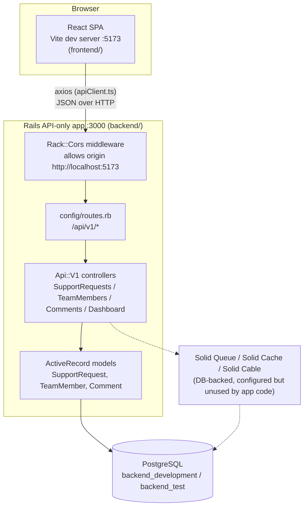
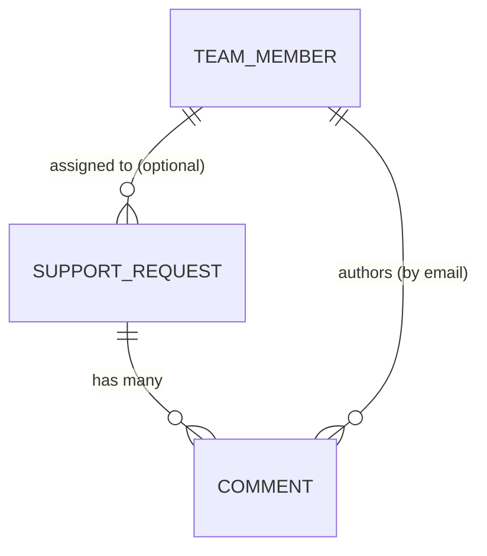
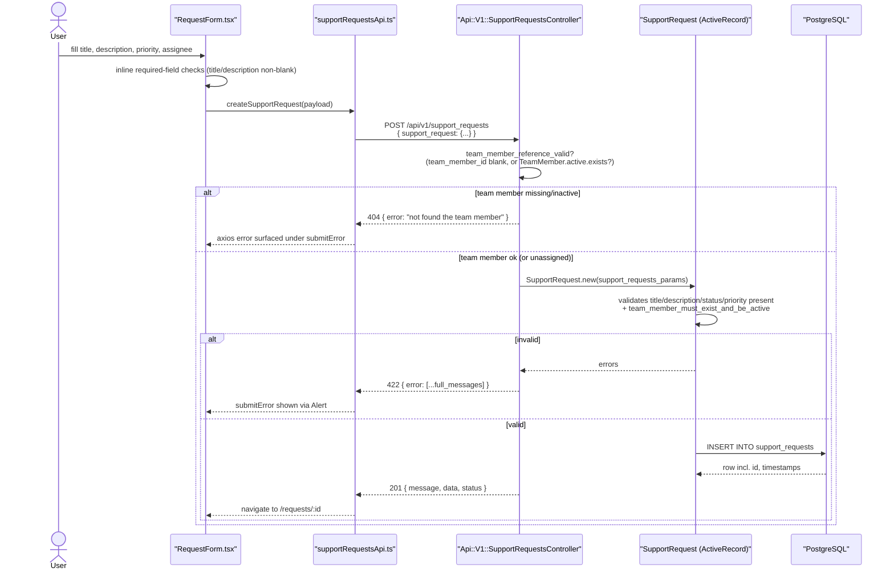
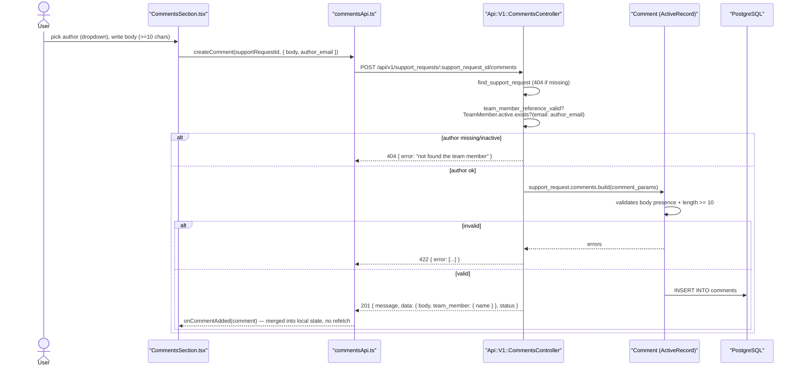

# SupportFlow — Architecture Overview

SupportFlow is an internal tool for registering, assigning, prioritizing, and tracking
technical support requests. The system is split into two independently deployable
applications that communicate over HTTP/JSON:

- **`backend/`** — a Ruby on Rails 8.1 API-only application backed by PostgreSQL.
- **`frontend/`** — a Vite + React 19 + TypeScript single-page application.

This document gives the system-level picture. For implementation detail see:

- [`backend/README.md`](backend/README.md) — models, controllers, business rules, config
- [`backend/data-model.md`](backend/data-model.md) — ER diagram and table reference
- [`backend/api-reference.md`](backend/api-reference.md) — full endpoint reference
- [`frontend/README.md`](frontend/README.md) — views, services, types, styling
- [`frontend/component-tree.md`](frontend/component-tree.md) — component inventory and diagrams
- [`known-issues.md`](known-issues.md) — inconsistencies found during this review

## 1. System diagram



Both apps run as **separate origins** in development (`http://localhost:3000` for Rails,
`http://localhost:5173` for Vite) — there is no shared session, no server-rendered HTML, and
no reverse proxy in front of them locally. `rack-cors` is enabled
(`backend/config/initializers/cors.rb`) and allows exactly one origin, read from
`AppConstants::FRONTEND_URL` (`backend/lib/constants.rb`, hardcoded to
`http://localhost:5173`).

## 2. Technology stack

| Layer | Choice | Notes |
|---|---|---|
| Backend framework | Rails 8.1.3, `config.api_only = true` | No views/sessions/cookies/asset pipeline |
| Language / runtime | Ruby 3.2.2 | `.ruby-version` |
| Database | PostgreSQL (`pg` gem) | Only adapter configured; enum-like columns are plain strings |
| Pagination | `pagy` 9.4 | `Pagy::Backend` mixed into `ApplicationController` |
| Background jobs / cache / pubsub | Solid Queue / Solid Cache / Solid Cable | Rails 8 defaults, DB-backed, **no jobs or mailers currently implemented** |
| Backend tests | RSpec + FactoryBot + Faker | Model specs + request (integration) specs only |
| Deployment | Kamal + Thruster, Docker | `backend/Dockerfile`, `backend/.kamal/` |
| Frontend framework | React 19 + TypeScript, Vite 8 | `npm run dev` on port 5173 |
| Routing | react-router-dom 7 (`BrowserRouter`) | 9 flat routes, no route nesting |
| HTTP client | Axios | Single preconfigured instance, `src/services/apiClient.ts` |
| State management | React local state (`useState`/`useEffect`) only | No Redux/Zustand/React Query |
| Styling | Plain CSS + custom properties | No Tailwind/Bootstrap/MUI/Ant Design |
| Frontend tests | Vitest + Testing Library + jsdom | Covers services, validations, TeamMembers/TeamMemberForm views only |

## 3. Domain at a glance

Three resources make up the whole domain:

- **Team Member** — a person who can be assigned support requests and author comments.
  Has a `role` (`developer` / `qa` / `support`) and an `active` flag (a one-way switch: once
  deactivated, a team member can never be reactivated — enforced in `TeamMember`).
- **Support Request** — the ticket being tracked. Has a `status`
  (`open` → `in_progress` → `resolved` → `closed`) and a `priority`
  (`low` / `medium` / `high` / `critical`), optionally assigned to one active team member.
  Once `closed`, a request is frozen (no further edits of any kind).
- **Comment** — free-text note on a support request, authored by a team member (referenced
  by **email**, not by id — see [data-model.md](backend/data-model.md)).



See [`backend/data-model.md`](backend/data-model.md) for full column definitions, indexes,
and the (non-standard) email-based foreign key on `comments`.

## 4. Request/response envelope convention

Every backend JSON response — success or validation failure — follows the same shape,
produced by `Response::ResponseData` (`backend/app/serializers/response/response_data.rb`):

```json
{
  "message": "Support request was found",
  "data": { "...": "..." },
  "status": "ok"
}
```

List (`index`) endpoints additionally merge in pagination info from
`Response::ResponsePaginationInfo`:

```json
{
  "message": "...",
  "data": [ "...": "..." ],
  "status": "ok",
  "pagination": { "page": 1, "pages": 3, "count": 25, "limit": 10, "next": 2, "prev": null }
}
```

There are no dedicated per-model serializer classes (no `ActiveModel::Serializer` /
`jbuilder` — `jbuilder` is commented out in the `Gemfile`); every controller action builds
its JSON shape inline with `ActiveRecord#as_json(except:, include:, methods:)`.

## 5. End-to-end flow: creating a support request



## 6. End-to-end flow: adding a comment



## 7. Deployment shape

- Backend: Docker image built from `backend/Dockerfile`, deployed via Kamal
  (`backend/config/deploy.yml`, `backend/.kamal/`). Production splits the database into four
  logical connections (`primary`, `cache`, `queue`, `cable`) per `config/database.yml`,
  backing Solid Cache/Queue/Cable respectively.
- Frontend: static Vite build (`npm run build`) — no server-side rendering, deployable to
  any static host or behind the same reverse proxy as the API.
- The two apps are **not yet unified behind one origin/proxy in any environment** described
  in the repo, so CORS remains a hard requirement, not a temporary dev-only shim, unless that
  changes.
