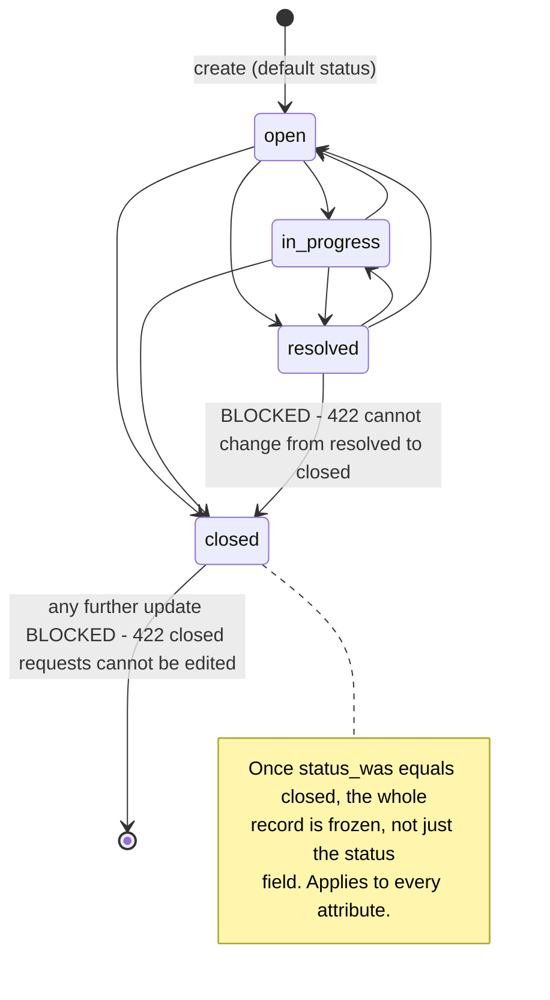

# Backend — SupportFlow API

Rails 8.1.3 API-only application (`config.api_only = true`, `backend/config/application.rb`),
Ruby 3.2.2, PostgreSQL. Serves JSON to the React frontend; no views, sessions, cookies, or
authentication layer exist anywhere in the app.

See also: [`data-model.md`](data-model.md) (ER diagram, table/column reference, migrations)
and [`api-reference.md`](api-reference.md) (every endpoint, params, example responses).

## 1. Directory structure

```
backend/
├── app/
│   ├── controllers/
│   │   ├── application_controller.rb      # ActionController::API + Pagy::Backend
│   │   └── api/v1/
│   │       ├── team_members_controller.rb
│   │       ├── support_requests_controller.rb
│   │       ├── comments_controller.rb
│   │       └── dashboard_controller.rb
│   ├── models/
│   │   ├── application_record.rb
│   │   ├── team_member.rb
│   │   ├── support_request.rb
│   │   └── comment.rb
│   ├── serializers/response/
│   │   ├── response_data.rb                # { message, data, status } envelope
│   │   └── response_pagination_info.rb     # { pagination: {...} }
│   ├── jobs/application_job.rb             # no concrete jobs implemented
│   ├── mailers/application_mailer.rb       # no concrete mailers implemented
│   └── views/layouts/mailer.{html,text}.erb
├── config/
│   ├── routes.rb
│   ├── database.yml                        # multi-db in production (primary/cache/queue/cable)
│   ├── initializers/cors.rb                # Rack::Cors, active
│   └── environments/{development,test,production}.rb
├── db/
│   ├── schema.rb                           # domain tables
│   ├── migrate/                            # 3 migrations
│   └── seeds.rb                            # 4 team members, 4 requests, comments
├── lib/constants.rb                        # AppConstants::FRONTEND_URL
├── spec/
│   ├── factories/ {team_members,support_requests,comments}.rb
│   ├── models/    {team_member,support_request,comment}_spec.rb
│   └── requests/api/v1/ {team_members,support_requests,comments,dashboard}_spec.rb
└── http_requests_support_flow.http         # 20 example requests, live API reference
```

## 2. Domain models

### `TeamMember` (`app/models/team_member.rb`)

```ruby
has_many :support_requests, dependent: :destroy

enum :role, { developer: "developer", qa: "qa", support: "support" }, validate: true

scope :active,          -> { where(active: true) }
scope :by_active,       ->(active) { ... }   # blank => no filter; else casts to boolean
scope :by_role,         ->(role)   { ... }   # blank / "undefined" / "null" => no filter
scope :search_by_name,  ->(name)   { ... }   # case-insensitive partial match

validates :name,   presence: true, length: { maximum: 100 }
validates :email,  presence: true, uniqueness: { case_sensitive: false },
                    format: { with: URI::MailTo::EMAIL_REGEXP }
validates :role,   presence: true
validates :active, inclusion: { in: [true, false] }

validate :active_cannot_be_reactivated, on: :update
```

**Business rule:** `active` is a one-way door. `true → false` is always allowed; `false → true`
is rejected on update (a fresh record can still be created with `active: true` directly). This
is the only way team members are ever removed from the system — there is no `destroy` action.

### `SupportRequest` (`app/models/support_request.rb`)

```ruby
self.record_timestamps = false   # model manages created_at/updated_at itself, see callbacks

belongs_to :team_member, optional: true
has_many :comments, -> { order(:created_at) }, dependent: :destroy

enum :status,   { open:"open", in_progress:"in_progress", resolved:"resolved", closed:"closed" }, validate: true
enum :priority, { low:"low", medium:"medium", high:"high", critical:"critical" }, validate: true

scope :overdue,        -> { where.not(status: %w[resolved closed]).where("due_date < ?", Date.current) }
scope :by_status,      ->(status)   { where(status: status) }
scope :by_priority,    ->(priority) { where(priority: priority) }
scope :assigned_to,    ->(team_member_id) { where(team_member_id: team_member_id) }
scope :unassigned,     -> { where(team_member_id: nil) }
scope :search_by_title,->(query) { where("title ILIKE ?", "%#{sanitize_sql_like(query)}%") }

validates :title, :description, :status, :priority, presence: true
validate :team_member_must_exist_and_be_active
validate :closed_request_cannot_be_edited, on: :update
validate :resolved_request_cannot_become_closed, on: :update

before_create :set_created_at
before_update :set_updated_at
before_save    :set_completed_at
```

#### Status state machine and business rules



- `team_member_must_exist_and_be_active` — a non-blank `team_member_id` must reference an
  existing **and active** team member, otherwise `errors[:team_member]`. A blank
  `team_member_id` is always valid (unassigned).
- `completed_at` is auto-stamped to `Time.current` the moment `status` becomes `resolved`
  (only if not already set), and cleared back to `nil` if status moves away from `resolved`.
- `overdue?` (model method, aliased `overdue`) — true only when `due_date` is in the past
  **and** status is neither `resolved` nor `closed`. The `overdue` scope mirrors this at the
  SQL level for the dashboard/list filters.
- Timestamps are **not** Rails-automatic here (`record_timestamps = false`); the model sets
  them itself via `before_create`/`before_update`, and the DB columns also default to
  `CURRENT_TIMESTAMP` as a second line of defense.

### `Comment` (`app/models/comment.rb`)

```ruby
belongs_to :support_request
belongs_to :team_member, foreign_key: :author_email, primary_key: :email

validates :body, presence: true, length: { minimum: 10 }
```

**Non-standard association:** a comment does not store a `team_member_id`. Instead it stores
`author_email` (a plain string column) and Active Record resolves the `team_member`
association by matching `author_email` against `team_members.email` (a unique, non-primary
key column). See [`data-model.md`](data-model.md) for the corresponding foreign key and a
flagged schema/migration drift on this column's `NOT NULL` constraint.

## 3. Controllers

Base: `ApplicationController < ActionController::API`, includes `Pagy::Backend`.

There is **no global `rescue_from`** — each controller handles `ActiveRecord::RecordNotFound`
locally inside its own `set_*`/`find_*` `before_action`, returning a `{ error: "..." }` body
and `:not_found`. A request missing its required top-level param key (e.g. POSTing without a
`support_request`/`comment`/`team_member` wrapper) is not explicitly rescued — Rails' default
`ActionController::ParameterMissing` behavior in API-only mode surfaces as `400 Bad Request`,
verified by the request specs.

| Controller | Actions | Notes |
|---|---|---|
| `Api::V1::TeamMembersController` | `index`, `show`, `create`, `update` | No `destroy`. `index` paginated with fixed `limit: 10` (no client override), filterable by `active`, `role`, `name`. |
| `Api::V1::SupportRequestsController` | `index`, `show`, `create`, `update` | No `destroy`. `index` paginated with `limit_max: 10` (client `?limit=` honored up to 10). Filterable by `status`, `priority`, `team_member_id`, `unassigned`, `overdue`, `q` (title search). Every create/update re-validates the assigned team member is active. |
| `Api::V1::CommentsController` | `create` only | Nested under a support request. Author identified by `author_email`, must belong to an active team member. |
| `Api::V1::DashboardController` | `index` | Aggregate counts only, no persistence. |

Full request/response contracts for every action are in
[`api-reference.md`](api-reference.md).

## 4. Response envelope classes

`app/serializers/response/` — no per-model serializers exist; instead two small envelope
classes wrap whatever hash/array a controller action builds inline with
`ActiveRecord#as_json(except:, include:, methods:)`:

- **`Response::ResponseData`** → `{ message, data, status }`
- **`Response::ResponsePaginationInfo`** → `{ pagination: { page, pages, count, limit, next, prev } }`,
  merged onto the above for `index` actions.

## 5. Configuration

- **CORS** (`config/initializers/cors.rb`) — **enabled**, not commented out. Allows exactly
  one origin: `AppConstants::FRONTEND_URL` (`lib/constants.rb`, hardcoded to
  `http://localhost:5173`), all headers, `GET/POST/PUT/PATCH/DELETE/OPTIONS/HEAD` on `"*"`.
- **Pagination** — `pagy` 9.4, with the `limit` extra loaded (`config/initializers/pagy.rb`)
  so index actions can accept a client-supplied `?limit=`.
- **No authentication** — `bcrypt` is present in the `Gemfile` but commented out; there is no
  `User` model, no session/token controller, no `has_secure_password` anywhere. Every endpoint
  is unauthenticated.
- **No JSON view templates** — `jbuilder` is commented out in the `Gemfile`; all serialization
  is inline `as_json`.
- **Jobs/Mailers** — `ApplicationJob`/`ApplicationMailer` exist as scaffolding only; no
  concrete subclasses. Solid Queue is wired as the production queue adapter but nothing is
  ever enqueued by the app.
- **Environments** — `development` uses `:memory_store` cache and eager-load off;
  `production` uses `:solid_cache_store`, `solid_queue` job adapter, and a 4-way split
  database (`primary`/`cache`/`queue`/`cable`); `test` uses `:null_store` and disables forgery
  protection. No custom timezone is set anywhere (defaults to UTC).

## 6. Tests (RSpec)

- **Factories** (`spec/factories/`): `team_member` (traits `:inactive`, `:qa`, `:support`),
  `support_request` (traits `:in_progress`, `:resolved`, `:closed`), `comment` (transient
  `team_member`, `author_email` defaults to that member's email).
- **Model specs**: full validation/enum/scope/callback coverage per model, including a
  data-table style spec for `SupportRequest#overdue?` across due-date × status combinations,
  and every closed/resolved status-transition rule.
- **Request specs** (`spec/requests/api/v1/`): integration-level coverage of every controller
  action — success envelopes, pagination shape, 404s, 422s with exact error messages, and the
  400 "missing wrapper key" case. `dashboard_spec.rb` verifies both the zeroed-state response
  and exact aggregate counts over a mixed dataset.
- No controller-unit specs, no system/feature specs — coverage is models + request specs only,
  which matches the API-only shape of the app.

## 7. Seed data (`db/seeds.rb`)

Idempotent (`find_or_create_by!`). Seeds 4 team members (Abigail/developer, Christian/qa,
Ronald/support, Sheila/qa), 4 support requests each assigned to one of them, and 2 comments
per request cycling through the team member list as authors. As a deliberate edge-case setup,
Sheila is deactivated **after** being assigned to a request — seeding the "inactive team
member still referenced by a legacy request" scenario for manual testing.

## 8. Key gems

| Gem | Version | Purpose |
|---|---|---|
| `rails` | 8.1.3 | Framework |
| `pg` | 1.6.3 | PostgreSQL adapter |
| `puma` | 8.0.2 | App server |
| `pagy` | 9.4.0 | Pagination |
| `rack-cors` | 3.0.0 | CORS (active) |
| `solid_cache` / `solid_queue` / `solid_cable` | 1.0.10 / 1.4.0 / 3.0.12 | DB-backed cache/jobs/pubsub |
| `dotenv-rails` | 3.2.0 | `.env` loading in dev/test |
| `kamal` / `thruster` | 2.12.0 / — | Docker-based deploy |
| `rspec-rails` / `factory_bot_rails` / `faker` | 8.0.4 / 6.6.0 / 3.8.0 | Test stack |
| `bcrypt` (commented out) | — | Not active — no auth |
| `jbuilder` (commented out) | — | Not active — no JSON view templates |
