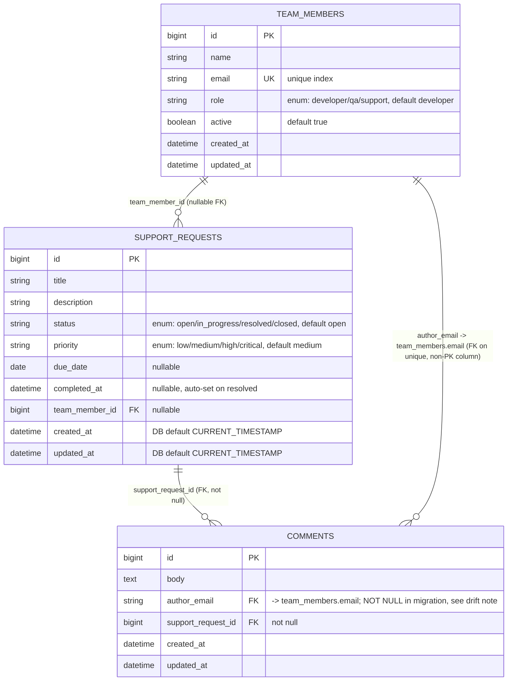

# Backend — Data Model

Schema version: `2026_07_23_164758` (`backend/db/schema.rb`), PostgreSQL, 3 migrations, 3
domain tables. Non-domain tables (`solid_queue_*`, `solid_cache_entries`,
`solid_cable_messages`) live in separate physical databases per
`backend/config/database.yml` and are infrastructure, not application data — omitted below.

## 1. Entity-relationship diagram



## 2. Table reference

### `team_members`

| Column | Type | Default | Constraints |
|---|---|---|---|
| `name` | string | — | `null: false` implied by model validation (presence, max 100) |
| `email` | string | — | `null: false`, **unique index** (`index_team_members_on_email`) |
| `role` | string | `"developer"` | `null: false`; app-level enum `developer` / `qa` / `support` |
| `active` | boolean | `true` | `null: false` |
| `created_at` / `updated_at` | datetime | — | `null: false`, standard Rails timestamps |

- One-way switch: `active: true → false` is permitted; `false → true` is rejected by
  `TeamMember#active_cannot_be_reactivated` (model-level only, not a DB constraint).
- `role` is a Postgres `varchar`, not a native Postgres `enum` type — validity is enforced by
  Rails' `enum ... validate: true`, not by the database.

### `support_requests`

| Column | Type | Default | Constraints |
|---|---|---|---|
| `title` | string | — | `null: false` |
| `description` | string | — | `null: false` |
| `status` | string | `"open"` | `null: false`; enum `open`/`in_progress`/`resolved`/`closed` |
| `priority` | string | `"medium"` | `null: false`; enum `low`/`medium`/`high`/`critical` |
| `due_date` | date | — | nullable |
| `completed_at` | datetime | — | nullable, model-managed |
| `team_member_id` | bigint | — | nullable FK → `team_members.id`, indexed |
| `created_at` / `updated_at` | datetime | `CURRENT_TIMESTAMP` (DB-level) | `null: false`; also model-managed (`record_timestamps = false`) |

- Unlike the other two tables, `created_at`/`updated_at` have an explicit **database-level**
  default (`CURRENT_TIMESTAMP`), set via a `change_column_default` in the `support_requests`
  migration and re-applied again in the `comments` migration. This exists because
  `SupportRequest.record_timestamps = false` disables Rails' usual automatic stamping — the DB
  default is a second line of defense in case the model callbacks don't fire (e.g. raw SQL).

### `comments`

| Column | Type | Default | Constraints |
|---|---|---|---|
| `body` | text | — | `null: false` per model (`length: { minimum: 10 }`); **not** `NOT NULL` at the DB level (see drift note) |
| `author_email` | string | — | FK → `team_members.email`; declared `null: false` in the migration, **not reflected as `NOT NULL` in `schema.rb`** (see drift note) |
| `support_request_id` | bigint | — | `null: false`, FK → `support_requests.id`, indexed |
| `created_at` / `updated_at` | datetime | — | `null: false` |

> **Schema drift note:** `db/migrate/20260723164758_create_comments.rb` declares
> `t.string :author_email, null: false`, but `db/schema.rb` renders the column as
> `t.string "author_email"` with no `null: false`. In practice this is masked by
> `Comment belongs_to :team_member, foreign_key: :author_email, primary_key: :email`, which
> is a required association by default (Rails 5+) — an absent/blank `author_email` still
> fails validation with `team_member: must exist`. But the **database itself** would accept a
> `NULL` `author_email` if inserted outside the model layer (raw SQL, a rake task, a future
> job). See [`known-issues.md`](../known-issues.md) for the recommended fix.

## 3. Migrations (in order)

| # | File | What it does |
|---|---|---|
| 1 | `20260721164631_create_team_members.rb` | Creates `team_members` (`name`, `email` unique-indexed, `role` default `"developer"`, `active` default `true`, timestamps). |
| 2 | `20260722153729_create_support_requests.rb` | Creates `support_requests` (`title`, `description`, `status` default `"open"`, `priority` default `"medium"`, `due_date`, `completed_at`, nullable `team_member_id` FK, timestamps); then sets `created_at`/`updated_at` DB column defaults to `CURRENT_TIMESTAMP`. |
| 3 | `20260723164758_create_comments.rb` | Creates `comments` (`body` not-null text, `author_email` not-null string, not-null `support_request_id` FK, timestamps); indexes `author_email`; adds FK `comments.author_email → team_members.email`; re-applies the `support_requests` timestamp-default change from migration 2 (redundant but harmless). |

## 4. Foreign keys (as declared in `schema.rb`)

```ruby
add_foreign_key "comments", "support_requests"
add_foreign_key "comments", "team_members", column: "author_email", primary_key: "email"
add_foreign_key "support_requests", "team_members"
```

No cascade options are specified on any foreign key (default `NO ACTION`) — deleting a
`team_member` or `support_request` that still has dependent rows would fail at the DB level
unless routed through the model's `dependent: :destroy` associations
(`TeamMember has_many :support_requests, dependent: :destroy`;
`SupportRequest has_many :comments, dependent: :destroy`). Since neither `TeamMember` nor
`SupportRequest` exposes a `destroy` action over the API, this only matters for
console/rake-task usage today.
