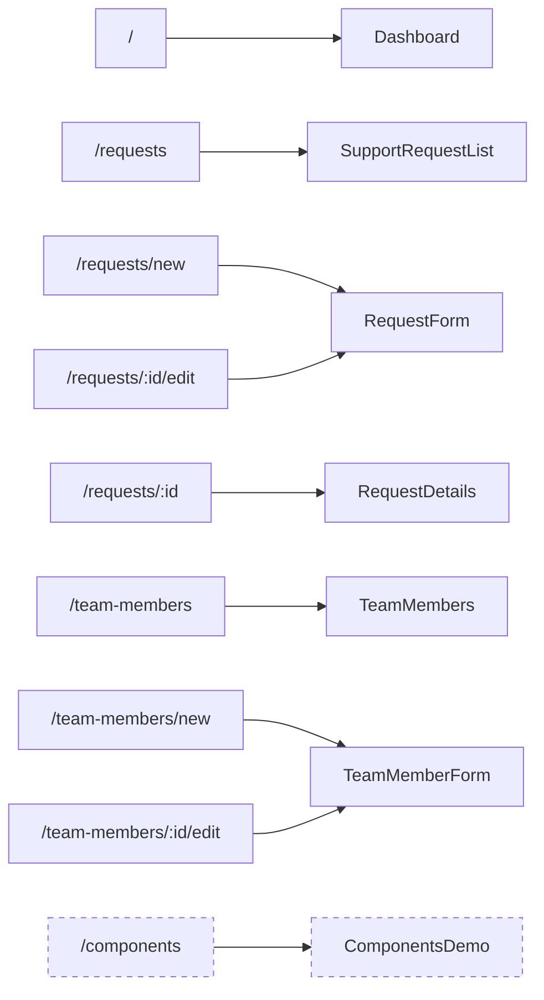
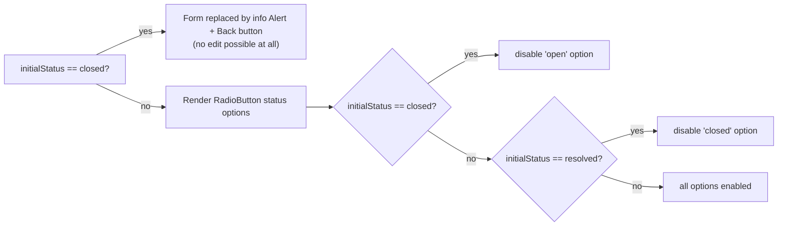

# Frontend — Component Inventory & Diagrams

Companion to [`README.md`](README.md). All component-to-view relationships below were
verified directly against each view's import statements, not inferred.

## 1. Route → View map

Dashed nodes (`/components` → `ComponentsDemo`) are reachable only by direct URL — they are
intentionally left out of `Navbar`'s 3 nav links (`/`, `/requests`, `/team-members`).

## 2. View → Component dependency graph

Built directly from each view's `components/` imports (verified via source, July 2026 state).

```mermaid
graph TD
    subgraph Views
        Dashboard
        SupportRequestList
        RequestForm
        RequestDetails
        CommentsSection["CommentsSection (co-located in RequestDetails/)"]
        TeamMembers
        TeamMemberForm
    end

    subgraph Layout["components/layout"]
        AppLayout
        Card
    end
    subgraph Common["components/common"]
        Button
        Badge
        StatusBadge
        PriorityBadge
        OverdueBadge
        Avatar
    end
    subgraph FormC["components/form"]
        TextBox
        TextArea
        Dropdown
        RadioButton
        Checkbox
    end
    subgraph DataC["components/data"]
        TableGrid
        Pagination
        Grid
    end
    subgraph Feedback["components/feedback"]
        Alert
        EmptyState
        LoadingSpinner
        ConfirmationDialog
    end

    Dashboard --> AppLayout & Card & Grid & StatusBadge & PriorityBadge & Alert & LoadingSpinner

    SupportRequestList --> AppLayout & Button & TableGrid & Pagination & OverdueBadge & PriorityBadge & StatusBadge & TextBox & Dropdown & Checkbox

    RequestForm --> AppLayout & Card & TextBox & TextArea & Dropdown & RadioButton & Button & Alert & LoadingSpinner

    RequestDetails --> AppLayout & Card & Button & OverdueBadge & PriorityBadge & StatusBadge & Alert & EmptyState & LoadingSpinner
    RequestDetails -.contains.-> CommentsSection
    CommentsSection --> Avatar & Button & Dropdown & TextArea & Alert

    TeamMembers --> AppLayout & Card & Grid & Avatar & Badge & Button & Alert & ConfirmationDialog

    TeamMemberForm --> AppLayout & Card & TextBox & RadioButton & Button & Alert
```

`ComponentsDemo` is omitted from the graph above for readability — it imports **every**
component in `components/**` (it's the internal catalog), plus `mockSupportRequests` from
`services/mockData.ts`.

Notable pattern: **every view uses `AppLayout` and `Alert`** — `AppLayout` for the consistent
navbar/header/breadcrumb shell, `Alert` for inline success/error/info messaging (there is no
global toast/snackbar system).

## 3. Component prop reference

### `common/`

| Component | Props | Notes |
|---|---|---|
| `Button` | `variant?: "primary"\|"secondary"\|"danger"` (default `primary`), `loading?`, `disabled?`, `onClick?`, `children` + native button attrs | Always `type="button"`; shows a spinner and self-disables when `loading` |
| `Badge` | `{ label: string; tone?: "neutral"\|"info"\|"primary"\|"warning"\|"success"\|"error" }` (default `neutral`) | Base pill; same file also exports the 3 derived badges below |
| `StatusBadge` | `{ status: RequestStatus }` | Maps status → tone/label, includes `"assigned"` |
| `PriorityBadge` | `{ priority: RequestPriority }` | Maps priority → tone/label; `critical` reuses the `error` tone (no dedicated tone) |
| `OverdueBadge` | *(none)* | Static `<Badge label="Overdue" tone="error" />` |
| `Chip` | `{ label: string; onRemove?: () => void }` | Renders a `×` button only if `onRemove` passed |
| `Avatar` | `{ name: string; size?: "sm"\|"md"\|"lg" }` (default `md`) | Up to 2 initials from whitespace-split `name` |
| `Divider` | `{ spacing?: "sm"\|"md"\|"lg" }` (default `md`) | Renders `
` |

### `layout/`

| Component | Props | Notes |
|---|---|---|
| `AppLayout` | `{ title, description?, breadcrumbs: BreadcrumbItem[], actions?, children }` | Composes `Navbar` + `PageContainer` (→ `Breadcrumb` + `Header` + content) + static footer |
| `Navbar` | *(none)* | Hard-coded 3-link nav array; `NavLink` active-state styling |
| `Header` | `{ title, description?, actions? }` | Title/description + right-aligned actions slot |
| `Breadcrumb` | `{ items: BreadcrumbItem[] }`, `BreadcrumbItem = { label, to? }` | Last item is always plain text; others are `Link` if `to` present |
| `PageContainer` | `{ children }` | `max-width: 1200px`, mobile-first padding |
| `Card` | `{ title?, children, className? }` | |

### `form/` (all controlled — no internal value state)

| Component | Props | Notes |
|---|---|---|
| `TextBox` | `{ label, type?: "text"\|"email"\|"password"\|"number"\|"date", helperText?, error?, onChange?: (value: string) => void }` + native input attrs | `"date"` is used live (`RequestForm` due date) but **undocumented in `frontend/README.md`** |
| `TextArea` | `{ label, rows?=4, helperText?, error?, onChange? }` + native textarea attrs | |
| `Dropdown` | `{ label, options: SelectOption[], value?, placeholder?="Select an option", required?, disabled?, error?, helperText?, onChange? }` | Renders a disabled placeholder `<option>` |
| `Checkbox` | `{ label, checked, disabled?, onChange?: (checked: boolean) => void }` | |
| `RadioButton` | `{ label, name, options: SelectOption[], value, onChange? }` | `SelectOption.disabled` lets `RequestForm` disable specific status transitions per the backend state machine |
| `Switch` | `{ label, checked, disabled?, onChange? }` | |

### `data/`

| Component | Props | Notes |
|---|---|---|
| `TableGrid<T>` | `{ columns: TableColumn<T>[], rows: T[], loading?, error?, emptyMessage?="No records found", zebra?, onRowClick?, onRetry?, getRowKey? }` | Generic, no external table library; branches to `LoadingSpinner`/`ErrorState`/`EmptyState` internally |
| `TableColumn<T>` | `{ header, field: keyof T \| string, align?, width?, formatter?: (row: T) => ReactNode }` | Falls back to `String(row[field])` with no `formatter` |
| `Pagination` | `{ currentPage, totalPages, onPageChange: (page: number) => void }` | Prev/Next auto-disable at bounds |
| `Grid` | `{ columns?: 1\|2\|3 (default 2), children }` | `columns=3` only renders 3 columns ≥1024px; 640–1023px it collapses to 2 |

### `feedback/`

| Component | Props | Notes |
|---|---|---|
| `Alert` | `{ variant: "success"\|"warning"\|"error"\|"info", title?, children }` | Icon glyphs `✓ / ⚠ / ✕ / ℹ` |
| `EmptyState` | `{ title, description?, action? }` | |
| `ErrorState` | `{ title?, description?, onRetry? }` | Retry button shown only if `onRetry` passed |
| `LoadingSpinner` | `{ label?="Loading..." }` | |
| `ConfirmationDialog` | `{ open, title, description?, confirmLabel?="Confirm", cancelLabel?="Cancel", danger?, onConfirm, onCancel }` | Returns `null` when `!open`; backdrop click → `onCancel` |

## 4. Support-request state → UI mapping

The frontend mirrors the backend's status state machine (see
[`../backend/README.md`](../backend/README.md#status-state-machine-and-business-rules))
directly in `RequestForm`'s JSX rather than duplicating it as a separate client-side model:

`RequestDetails` additionally disables its own Edit button whenever `status === "closed"`,
so a closed request can never even reach `RequestForm` in edit mode through the UI (the
backend's own `closed_request_cannot_be_edited` validation is the authoritative guard either
way).
